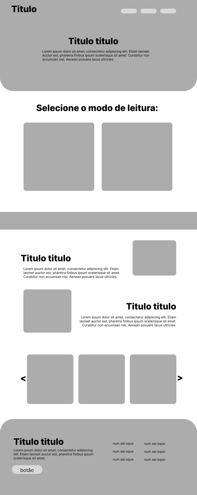
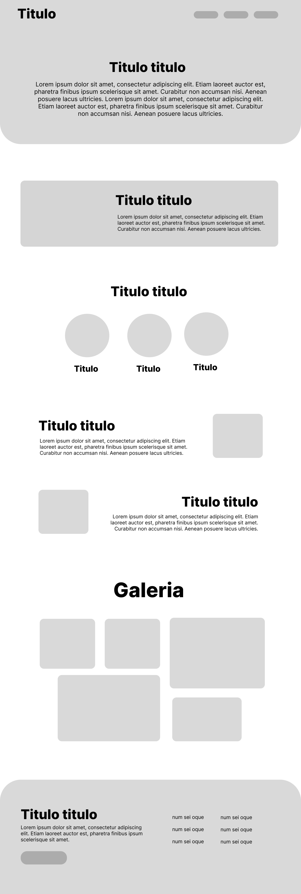
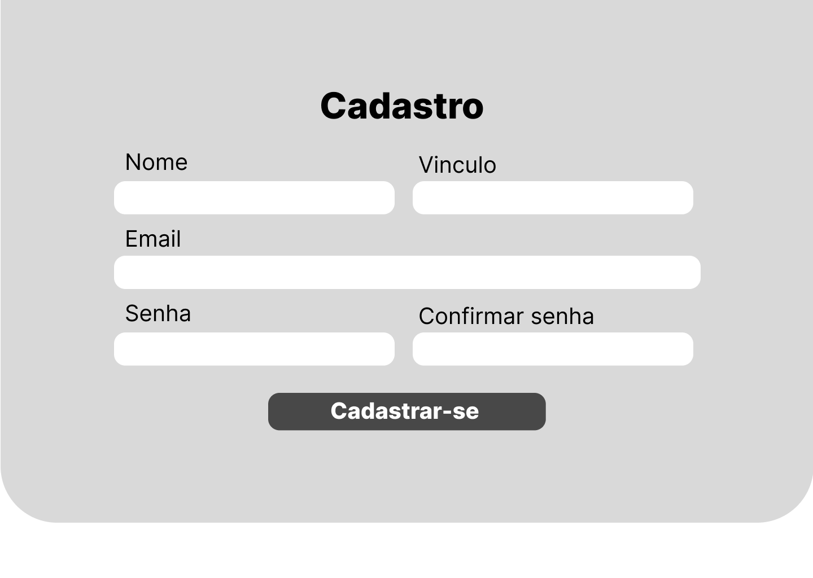

# INSTITUTO FEDERAL DE EDUCAÇÃO, CIÊNCIA E TECNOLOGIA DO RIO GRANDE DO NORTE

   

## ELLAINY NAYARA MOTTA DOS SANTOS  
## MATEUS COSME

   

# INTERACTIVE FLIPBOOK

     

### SÃO PAULO DO POTENGI  
### 2025

## ELLAINY NAYARA MOTTA DOS SANTOS  
## MATEUS COSME

   

# INTERACTIVE FLIPBOOK

  

Trabalho de Conclusão de Curso apresentado como requisito parcial para a obtenção do título de **Técnico Integrado em Informática para Internet** pelo Instituto Federal de Educação, Ciência e Tecnologia do Rio Grande do Norte – Campus São Paulo do Potengi.

 

**Orientador:** Diego Cirilo

   

### SÃO PAULO DO POTENGI  
### 2025

## LISTA DE SIGLAS

- **PPI** – Plataforma dos Projetos Integradores  
- **CSS** – Cascading Style Sheets  
- **HTML** – Hypertext Markup Language  
- **IFRN** – Instituto Federal de Educação, Ciência e Tecnologia do Rio Grande do Norte  
- **SQL** – Structured Query Language  
- **URL** – Uniform Resource Locator  
- **RF** – Requisitos Funcionais  
- **RNF** – Requisitos Não Funcionais

## SUMÁRIO

- [INTRODUÇÃO](#introdução)
- [JUSTIFICATIVA](#justificativa)
- [PÚBLICO-ALVO](#público-alvo)
- [OBJETIVOS](#objetivos)
- [ANÁLISE E PROJETO](#análise-e-projeto)
  - [Visão Geral do Sistema](#visão-geral-do-sistema)
  - [Atores do Sistema](#atores-do-sistema)
- [LEVANTAMENTO DE REQUISITOS](#levantamento-de-requisitos)
  - [Requisitos Funcionais](#requisitos-funcionais)
  - [Requisitos Não Funcionais](#requisitos-não-funcionais)
- [DIAGRAMAS DE CASO DE USO](#diagramas-de-caso-de-uso)
  - [Expansão do Caso de Uso – Gerenciar Sistema](#expansão-do-caso-de-uso--gerenciar-sistema)
- [DIAGRAMA DE CLASSES](#diagrama-de-classes)
- [PROTÓTIPOS DE TELA](#protótipos-de-tela)
- [CONCLUSÃO](#conclusão)
- [REFERÊNCIAS](#referências)

##  INTRODUÇÃO

No IFRN – Campus São Paulo do Potengi, alunos de diferentes cursos desenvolvem projetos de extensão com o objetivo de aproximar a comunidade do ambiente escolar e promover ações de impacto social, ambiental e educativo. Um desses projetos resultou na criação do livro **“Um Festival de Mudanças”**, escrito por estudantes do curso técnico em Meio Ambiente e ilustrado por alunos de outros cursos, com foco na educação ambiental, nas experiências de intercâmbio e na internacionalização.

Apesar da relevância do conteúdo, o acesso ao livro ainda estava limitado ao formato físico e a apresentações pontuais. Pensando nisso, surgiu a proposta de transformar essa produção em uma **plataforma digital interativa**, que permitisse maior alcance e acessibilidade.

Nesse contexto, o projeto **Interactive FlipBook** surge como uma proposta inovadora para transformar o livro “Um Festival de Mudanças” em uma plataforma digital interativa, acessível e visualmente atraente. A ideia é proporcionar uma nova forma de leitura e interação, tornando o conteúdo do livro mais dinâmico, envolvente e acessível a diferentes públicos.

O projeto também integra conhecimentos adquiridos ao longo da formação técnica, unindo design, UI/UX, programação, usabilidade e compromisso social em uma solução inovadora. Dessa forma, busca-se **ampliar o alcance da mensagem ambiental do livro**, incentivando a reflexão e a conscientização sobre as mudanças climáticas e a importância das ações locais para o impacto global.

Além disso, o sistema também conta com uma aparência personalizável e administração por uma dashboard com layout simples e atraente proporcionando conforto, controle e facilidade para que um usuário sem conhecimento técnico na área de tecnologia possa administrar o site livremente.

---

##  JUSTIFICATIVA
O livro “Um Festival de Mudanças”, desenvolvido por alunos do curso técnico em Meio Ambiente do IFRN – Campus São Paulo do Potengi, surgiu de um projeto de extensão que aborda mudanças climáticas e intercâmbio cultural. No entanto, há limitação a  seu alcance e a acessibilidade é limitada.
A proposta deste trabalho de Prática Profissional Integrada é desenvolver um site com efeito de livro 3D, responsivo e visualmente atrativo, utilizando tecnologias como Django, HTML, CSS, Bootstrap, Turn.js e jQuery. Essa plataforma permitirá o gerenciamento dinâmico do conteúdo por meio de um painel administrativo, facilitando atualizações e manutenção da obra digital.
Ao unir design, funcionalidade e tecnologia, o projeto promove a integração entre cursos e áreas do conhecimento, incentivando a divulgação científica e a educação ambiental de forma inovadora. A iniciativa também reforça a importância da extensão como espaço de formação crítica, criativa e cidadã, e demonstra, na prática, as competências desenvolvidas ao longo do curso técnico em Informática para Internet.

---

##  PÚBLICO-ALVO

O público-alvo principal são os **estudantes** do IFRN – Campus São Paulo do Potengi, especialmente aqueles envolvidos em projetos acadêmicos e de extensão. O sistema também contempla **professores**, **pesquisadores** e **usuários externos** interessados em educação ambiental, internacionalização e produções acadêmicas.

---

##  OBJETIVOS

No IFRN Campus São Paulo do Potengi, este projeto busca fortalecer a divulgação do conhecimento produzido por meio da extensão e promover a conexão entre estudantes, comunidade acadêmica e público em geral. A seguir, os objetivos deste trabalho:
- Desenvolver uma **plataforma digital interativa** para divulgação do livro “Um Festival de Mudanças”.
- Facilitar o acesso e a leitura do conteúdo de forma **dinâmica, atrativa e acessível**.
- Promover a integração entre os cursos de **Meio Ambiente** e **Informática para Internet**, estimulando a interdisciplinaridade.
- Estimular o uso de **tecnologias digitais** aplicadas à educação ambiental e à comunicação científica.
- Valorizar o trabalho dos estudantes e ampliar a visibilidade do projeto de extensão dentro e fora do campus..

---

##  ANÁLISE E PROJETO

###  VISÃO GERAL DO SISTEMA

O sistema **Livro Interativo 3D** é uma plataforma digital desenvolvida para disponibilizar de forma acessível e interativa o livro “Um Festival de Mudanças”.  

Funcionalidades principais:

- Leitura em PDF ou **formato flipbook 3D**
- Experiência responsiva (desktop e mobile)
- Personalização do site pelo administrador (cores, textos e livro)
- Página de internacionalização com **notícias e relatos de intercâmbio**

---

###  ATORES DO SISTEMA

| Ator                | Descrição                                                          |
| ------------------- | ------------------------------------------------------------------ |
| **Externos**        | Usuários não cadastrados com acesso ao conteúdo público do site.   |
| **Alunos**          | Usuários com registro no sistema e acesso ao próprio perfil.       |
| **Administradores** | Gerenciam conteúdo, visual do site e seção de internacionalização. |
| **Google**          | Sistema mediador de login.                                         |

---

## LEVANTAMENTO DE REQUISITOS

###  Requisitos Funcionais

| Código | Nome                        | Descrição                                                                    | Prioridade |
| ------ | --------------------------- | ---------------------------------------------------------------------------- | ---------- |
| RF01   | Cadastrar usuário           | Permitir que alunos de fora do IFRN se cadastrem com email.                  | Alta       |
| RF02   | Login                       | Usuários cadastrados poderão fazer login.                                    | Alta       |
| RF03   | Gerenciar conteúdo do livro | Administradores poderão adicionar, editar e excluir páginas.                 | Alta       |
| RF04   | Visualizar livro            | Usuários poderão acessar o livro em flipbook ou PDF.                         | Alta       |
| RF05   | Personalizar textos         | Administradores poderão adicionar e editar os textos das páginas do sistema. | Alta       |
| RF06   | Personalizar Sistema        | Administradores poderão adicionar e editar informações do site               | Alta       |
| RF07   | Personalizar tema           | Administradores poderão selecionar paletas de cores.                         | Média      |
| RF08   | Perfil do usuário           | Visualizar e editar informações pessoais.                                    | Média      |
| RF09   | Baixar PDF                  | Permitir o download do livro em PDF.                                         | Baixa      |

> Fonte: Elaboração própria (2025)

---

### Requisitos Não Funcionais

| Código | Descrição                                                                           | Categoria      |
| ------ | ----------------------------------------------------------------------------------- | -------------- |
| RNF01  | O sistema deve funcionar em ambiente web, compatível com navegadores modernos.      | Organizacional |
| RNF02  | Deve utilizar HTML, CSS, Python e JavaScript.                                       | Organizacional |
| RNF03  | Áreas administrativas devem ser restritas a usuários autenticados (incluindo SUAP). | Produto        |
| RNF04  | As senhas devem ser armazenadas de forma criptografada utilizando os mecanismos de segurança nativos do framework Django.                                           | Produto        |
| RNF05  | O banco de dados utilizado será o SQLite.                                           | Organizacional |
| RNF06  | A interface deve ser responsiva e acessível.                                        | Produto        |

---
##  DIAGRAMAS DE CASO DE USO

O diagrama de casos de uso descreve o escopo do sistema projetado, além de especificar textualmente este escopo,
a técnica de casos de uso é uma excelente ferramenta para abstrair os requisitos funcionais e atores do sistema, mostrando quem
eles são e como interagem entre si. Dessa forma, levando em consideração os atores e os requisitos funcionais deste trabalho, 
foram definidos 15 (quinze) casos de uso, conforme ilustrado na Figura 1. 

---

Figura 1 - Diagrama de caso do projeto 

Fonte: Elaboração própria (2025)

## 2.5 EXPANSÃO DO CASO DE USO – GERENCIAR SISTEMA

O caso de uso **Gerenciar Sistema** é um dos casos de maior risco da aplicação, pois envolve operações críticas de administração e manutenção das informações do sistema. Nesta seção são especificadas as ações que o usuário **Administrador** pode executar no sistema com o objetivo de **cadastrar, editar e excluir os textos e cores padrão**, além de **editar informações gerais do sistema** com do site como nome do sistema, logo e contato.  
Somente usuários com permissão de administrador poderão acessar e executar este caso de uso.

### 2.5.1 Atores
- Administrador

### 2.5.2 Pré-condição
O usuário deve estar autenticado no sistema e possuir permissão de administrador, concedida pelo administrador principal do sistema.

### 2.5.3 Pós-condição
O sistema exibe o **dashboard administrativo**, refletindo as alterações realizadas pelo administrador.

### 2.5.4 Requisitos Funcionais
- **RF03** – Gerenciar conteúdo do livro   
- **RF05** – Personalizar textos 
- **RF06** – Personalizar Sistema  
- **RF07** – Personalizar tema  

### 2.5.5 Requisitos Não Funcionais
- **RNF003** – Acesso restrito a usuários com perfil de administrador.

---

### 2.5.6 Fluxo Principal 01 – Gerenciar conteúdo do livro   

1. **[EV]** Na tela do dashboard administrativo, o administrador clica na opção **“Gerenciar páginas”** logo após em Gerenciamento do livro.
2. **[RS]** O sistema exibe o formulário de cadastro do livro.
3. **[EV]** O administrador informa os dados do livro, como título, descrição, capa, imagens, páginas do livro e demais informações necessárias.
4. **[RS]** O sistema valida os dados informados.
5. **[RS]** O sistema salva as informações no banco de dados.
6. **[RS]** O sistema exibe uma mensagem de sucesso e apresenta o livro cadastrado no painel administrativo.

---

### 2.5.7 Fluxo Principal 02 – Excluir Livro

1. **[EV]** Na tela do dashboard administrativo, o administrador seleciona o livro desejado e clica na opção **“Excluir”**.
2. **[RS]** O sistema solicita a confirmação da exclusão.
3. **[EV]** O administrador confirma a exclusão.
4. **[RS]** O sistema remove os dados do livro do banco de dados.
5. **[RS]** O sistema exibe uma mensagem confirmando a exclusão do livro.

---

### 2.5.8 Fluxo Principal 03 – Editar Livro

1. **[EV]** Na tela do dashboard administrativo, o administrador seleciona o livro e clica na opção **“Editar”**.
2. **[RS]** O sistema apresenta o formulário de edição com os dados previamente cadastrados do livro.
3. **[EV]** O administrador modifica os campos desejados (título, descrição, imagens, páginas do livro, idioma ou outras informações).
4. **[RS]** O sistema valida as alterações realizadas.
5. **[RS]** O sistema salva as alterações no banco de dados.
6. **[RS]** O sistema exibe o livro atualizado no painel administrativo.

---

### 2.5.9 Fluxos Alternativos

**1a. Administrador deseja editar um livro existente**

1. O administrador seleciona o livro desejado.
2. O sistema carrega os dados do livro.
3. O administrador realiza as alterações necessárias.
4. O administrador confirma as alterações.
5. O sistema salva os dados atualizados.
6. O fluxo retorna ao passo final do **Fluxo Principal 03**.

---

### 2.5.10 Fluxos de Exceção

**3a. Campo obrigatório não preenchido**  
- O sistema informa que os campos obrigatórios devem ser preenchidos para concluir a operação.

**3b. Formato de arquivo inválido**  
- O sistema informa que o formato do arquivo enviado não é permitido, indicando o formato correto aceito pelo sistema.

## DIAGRAMA DE CLASSES
O diagrama de classes representa a estrutura de um sistema mostrando suas classes, atributos, métodos e os relacionamentos entre elas. É usado para modelar a arquitetura de um sistema orientado a objetos.

---

#a imagen irá aqui

Fonte: Elaboração própria (2025)

## Prototipos de tela
Protótipos de tela desenvolvidos no Figma, com foco em um layout simples, intuitivo e confortável para o usuário, utilizando bordas arredondadas e elementos visuais de maior destaque para facilitar a navegação e a usabilidade.

## CONCLUSÃO

O desenvolvimento do projeto Interactive FlipBook possibilitou a aplicação prática dos conhecimentos adquiridos ao longo do curso técnico integrado em Informática para Internet, integrando áreas como desenvolvimento web, design de interfaces, usabilidade e engenharia de software. A proposta atendeu ao objetivo de transformar o livro “Um Festival de Mudanças” em uma plataforma digital interativa, ampliando seu alcance e tornando o conteúdo mais acessível e atrativo.

A plataforma contribui para a divulgação de um projeto de extensão, reforçando a importância da educação ambiental e do uso de tecnologias digitais no contexto educacional. Recursos como o efeito de livro 3D, a responsividade e a personalização visual proporcionam uma experiência de leitura inovadora e alinhada às práticas atuais de interação digital.

Além disso, o sistema conta com um painel administrativo intuitivo, permitindo a gestão autônoma do conteúdo e garantindo facilidade de manutenção e atualização da obra digital. Dessa forma, o Interactive FlipBook evidencia o potencial da tecnologia como ferramenta de apoio à educação e à extensão acadêmica, fortalecendo a integração entre instituição, estudantes e comunidade.

## REFERÊNCIAS BIBLIOGRÁFICAS:

BRASIL. Instituto Federal de Educação, Ciência e Tecnologia do Rio Grande do Norte. Projeto Pedagógico do Curso Técnico Integrado em Informática para Internet. IFRN, 2025.

DJANGO SOFTWARE FOUNDATION. Django Documentation. Disponível em: https://docs.djangoproject.com/. Acesso em: 2025.

BOOTSTRAP. Bootstrap Documentation. Disponível em: https://getbootstrap.com/. Acesso em: 2025.

TURN.JS. Turn.js – HTML5 Flipbook Plugin. Disponível em: https://www.turnjs.com/. Acesso em: 2025.

FIGMA. Figma: Interface Design Tool. Disponível em: https://www.figma.com/. Acesso em: 2025.

NIELSEN, Jakob. Usability Engineering. San Francisco: Morgan Kaufmann, 1994.

PRESSMAN, Roger S. Engenharia de Software: uma abordagem profissional. 8. ed. Porto Alegre: AMGH, 2016.

SOMMERVILLE, Ian. Engenharia de Software. 10. ed. São Paulo: Pearson, 2019.

> Projeto em *desenvolvimento* - IFRN-SPP |  2025 
